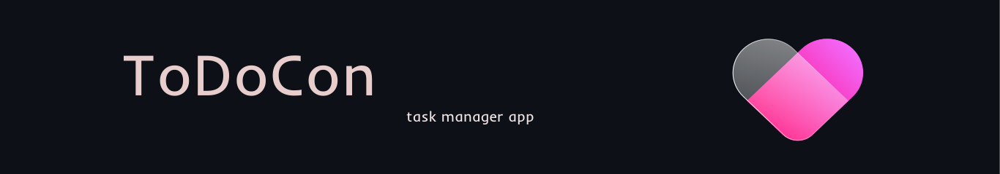

### 📋 ToDoCon —
This is a web application for planning by category, with authorization via VK, Telegram bot and the ability to share goals.
___

 [todocon.ga](http://todocon.ga)&nbsp;&nbsp;&nbsp;&nbsp;&nbsp;&nbsp;&nbsp;&nbsp;
[@todocon_bot](https://t.me/todocon_bot)
___
### Back-end functionality:
- Create/view/edit/delete boards, categories, goals and comments on them
- Setting the priority and deadline for each goal.
- Three levels of access to the board, including the ability to read and edit:

&nbsp;&nbsp;&nbsp;&nbsp;

- Login and password authorization or via a social network vk.com.
- Personal account with the ability to change login, password, first name, last name and email address.
- Telegram bot for viewing created categories and goals, with the function of creating new goals in existing categories.

___
## Tech stack:
&nbsp;&nbsp;
&nbsp;&nbsp;
&nbsp;&nbsp;
&nbsp;&nbsp;
&nbsp;&nbsp;
___

## Usage:
1) Clone the repository
`git clone https://github.com/Alstacon/ToDoCon.git`.
2) Change `.env.example`'s file name for `.env` and fill it with valid parameters.
3) Run docker `docker-compose up --build -d`.
